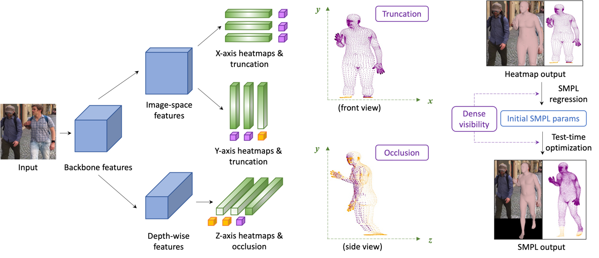
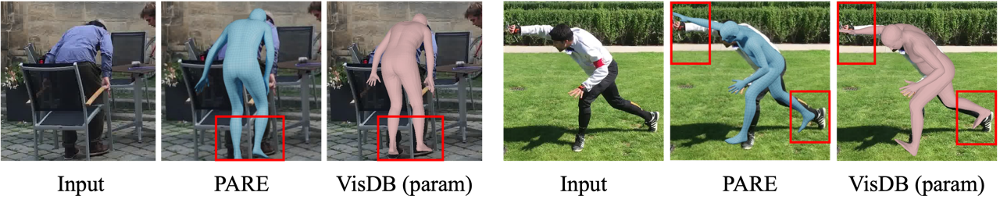
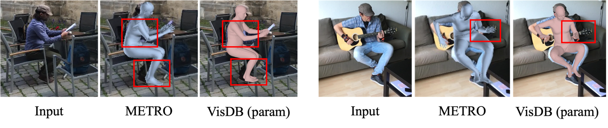

# VisDB: Visibility-aware Dense Body

<p align="center">  
  
</p> 

## Introduction

This repo contains the PyTorch implementation of "[Learning Visibility for Robust Dense Human Body Estimation]()" (ECCV'2022). Extended from a heatmap-based representation in [I2L-MeshNet](https://github.com/mks0601/I2L-MeshNet_RELEASE), we explicitly model the dense visibility of human joints and vertices to improve the robustness on partial-body images. 


## Example Results

We show some qualitative comparisons against prior arts which can handle occlusions: [PARE](https://openaccess.thecvf.com/content/ICCV2021/papers/Kocabas_PARE_Part_Attention_Regressor_for_3D_Human_Body_Estimation_ICCV_2021_paper.pdf) and [METRO](https://openaccess.thecvf.com/content/CVPR2021/papers/Lin_End-to-End_Human_Pose_and_Mesh_Reconstruction_with_Transformers_CVPR_2021_paper.pdf). We observe that PARE and METRO are robust to occlusions in general but VisDB aligns with the images better thanks to the accurate dense heatmap and visibility estimations. 

<p align="center">  
  
</p> 
<p align="center">  
  
</p> 


## Setup

We implement VisDB with Python 3.7.10 and PyTorch 1.8.1. Our code is mainly built upon this repo: [I2L-MeshNet](https://github.com/mks0601/I2L-MeshNet_RELEASE).

* Install **[PyTorch](https://pytorch.org)** and Python >= 3.7.3 and run `sh requirements.sh`. 
* Change `torchgeometry` kernel code slightly following [here](https://github.com/mks0601/I2L-MeshNet_RELEASE/issues/6#issuecomment-675152527).
* Download the pre-trained VisDB models (available soon).
* Download `basicModel_f_lbs_10_207_0_v1.0.0.pkl` and `basicModel_m_lbs_10_207_0_v1.0.0.pkl` from [here](https://smpl.is.tue.mpg.de/) and `basicModel_neutral_lbs_10_207_0_v1.0.0.pkl` from [here](http://smplify.is.tue.mpg.de/). Place them under `common/utils/smplpytorch/smplpytorch/native/models/`.
* Download DensePose UV files `UV_Processed.mat` and `UV_symmetry_transforms.mat` from [here](https://dl.fbaipublicfiles.com/densepose/densepose_uv_data.tar.gz) and place them under `common/`.
* Download GMM prior `gmm_08.pkl` from [here](https://github.com/vchoutas/smplify-x/files/3295771/gmm_08.zip) and place it under `common/`.


## Quick demo
* Prepare `input.jpg` and pre-trained snapshot in the `demo/` folder.
* Go to `demo` folder and edit `bbox` in `demo.py`.
* Run `python demo.py --gpu 0 --stage param --test_epoch 8` if you want to run on gpu 0.
* Output images can be found under `demo/`.
* If you run this code in ssh environment without display device, do follow:
```
1、Install oemesa follow https://pyrender.readthedocs.io/en/latest/install/
2、Reinstall the specific pyopengl fork: https://github.com/mmatl/pyopengl
3、Set opengl's backend to egl or osmesa via os.environ["PYOPENGL_PLATFORM"] = "egl"
```

## Usage

### Data preparation
* Download training and testing data (MSCOCO, MuCo, Human3.6M, and 3DPW) following [I2L-MeshNet](https://github.com/mks0601/I2L-MeshNet_RELEASE)'s instructions.
* Run DensePose on images following [here](https://github.com/facebookresearch/detectron2/blob/main/projects/DensePose/doc/TOOL_APPLY_NET.md) and store the UV estimations in individual data directories (e.g. `ROOT/data/PW3D/dp/`).

### Training

#### 1. lixel stage
First, you need to train VisDB in `lixel` stage. In the `main/` folder, run  
```bash  
python train.py --gpu 0-3 --stage lixel 
```  
to train the `lixel` model on GPUs 0-3. 

#### 2. param stage
Once you pre-trained VisDB in `lixel` stage, you can resume training in `param` stage. In the `main/` folder, run  
```bash  
python train.py --gpu 0-3 --stage param --continue
```  
to train the `param` model on GPUs 0-3.

### Testing
Place trained model at the `output/model_dump/`.  Choose the stage you want to test among (`lixel` or `param`).
  
In the `main/` folder, run  
```bash  
python test.py --gpu 0-3 --stage $STAGE --test_epoch 8 
```


## Contact

[Chun-Han Yao](https://www.chhankyao.com/): <cyao6@ucmerced.edu>


## Citation

If you find our project useful in your research, please consider citing:

```
@inproceedings{yao2022learning,
  title={Learning visibility for robust dense human body estimation},
  author={Yao, Chun-Han and Yang, Jimei and Ceylan, Duygu and Zhou, Yi and Zhou, Yang, and Yang, Ming-Hsuan},
  booktitle={European conference on computer vision (ECCV)},
  year={2022}
}
```